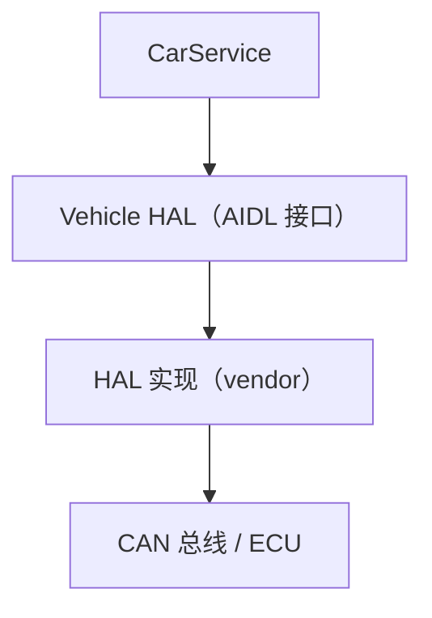
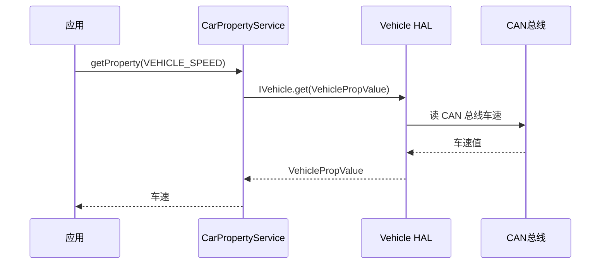

# Vehicle HAL 深入：从 AIDL 到实现

> 系列：AAOS-Guide · 12-vehicle-hal
> 难度：⭐⭐⭐⭐⭐ 深入
> 更新：2026-08-27
> 前置知识：《CarService 架构》《AIDL 深入》

---

## 一、Vehicle HAL 是什么

Vehicle HAL（硬件抽象层）是 CarService 和车辆硬件之间的「翻译官」：



**核心理解**：CarService 不直接碰 CAN 总线，而是通过 Vehicle HAL 的 AIDL 接口与硬件交互。这样上层的 CarService 与具体的硬件实现解耦。

## 二、Vehicle HAL 的 AIDL 定义

Vehicle HAL 用 AIDL 定义接口，位于 AOSP 的 `hardware/interfaces/automotive/vehicle`：

```java
// IVehicle.aidl（简化）
interface IVehicle {
    // 读取属性
    VehiclePropValue get(VehiclePropValue requestProp);

    // 设置属性
    void set(VehiclePropValue propValue);

    // 订阅属性变化
    void subscribe(IVehicleCallback callback, List<SubscribeOptions> options);
}
```

## 三、VehiclePropValue 数据结构

这是 Vehicle HAL 的核心数据结构：

```java
// 车辆属性值（简化）
struct VehiclePropValue {
    int prop;          // 属性 ID（如 VEHICLE_SPEED）
    int areaId;        // 区域（多区时）
    int status;        // 状态（可用/不可用）
    long timestamp;    // 时间戳
    int valueType;     // 值类型（int/float/string...）
    // 具体值
    int intValue;
    float floatValue;
    String stringValue;
}
```

## 四、一次读车速的完整链路



## 五、属性订阅机制（Subscribe）

CarService 通过订阅机制持续获取属性变化，而不是轮询：

```java
// CarPropertyService 订阅车速变化
IVehicleCallback callback = new IVehicleCallback.Stub() {
    @Override
    public void onPropertyEvent(List<VehiclePropValue> values) {
        // 属性变化，更新缓存并通知上层
        for (VehiclePropValue v : values) {
            updateCache(v);
            notifyListeners(v);
        }
    }
};

vehicle.subscribe(callback, subscribeOptions);
```

**核心理解**：订阅比轮询高效，硬件只在值变化时上报。

## 六、HAL 实现（vendor 侧）

车企或供应商负责实现 Vehicle HAL：

```cpp
// vendor 的 HAL 实现（C++ 简化）
class VehicleHalImpl : public IVehicle {
    VehiclePropValue get(VehiclePropValue request) override {
        int propId = request.prop;
        // 通过 CAN 总线读取
        float speed = readSpeedFromCanBus();
        VehiclePropValue result;
        result.prop = propId;
        result.floatValue = speed;
        result.status = VehiclePropertyStatus::AVAILABLE;
        return result;
    }
};
```

## 七、Vehicle HAL 的重要性

| 维度 | 说明 |
|------|------|
| 解耦 | CarService 与硬件解耦 |
| 标准化 | AIDL 接口统一 |
| 可替换 | 不同车用不同 HAL 实现 |
| 版本化 | HAL 接口可独立演进 |

## 八、调试 Vehicle HAL

```bash
# 查看车辆属性列表
adb shell dumpsys car_service

# 模拟车辆属性（测试用）
adb shell cmd car_service inject-vhal-event VEHICLE_SPEED 30.5
```

**inject-vhal-event** 是调试利器，可以模拟车辆数据，无需真实硬件。

## 九、总结

| 要点 | 结论 |
|------|------|
| Vehicle HAL | 硬件抽象层，AIDL 接口 |
| 核心结构 | VehiclePropValue |
| 订阅机制 | subscribe + callback |
| 调试 | inject-vhal-event 模拟 |

---

**下一篇预告**：《车载蓝牙电话：HFP 协议》

> 配套仓库：[AAOS-Guide](https://github.com/jason5200/AAOS-Guide)
