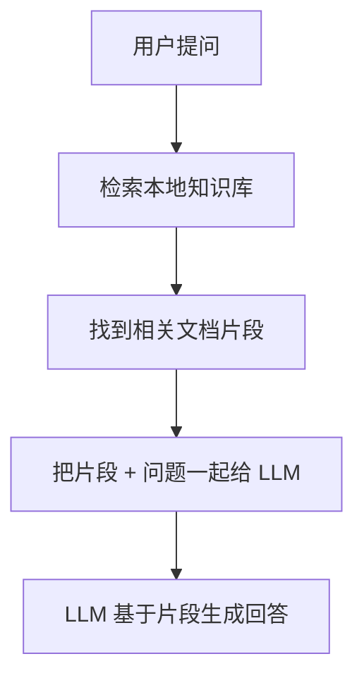
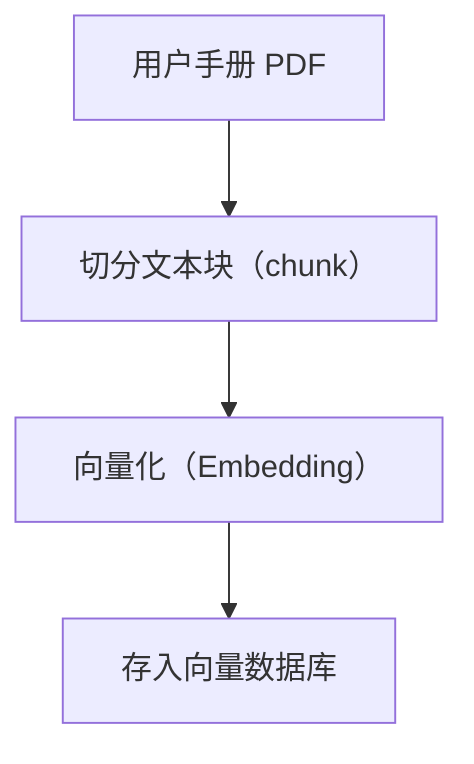
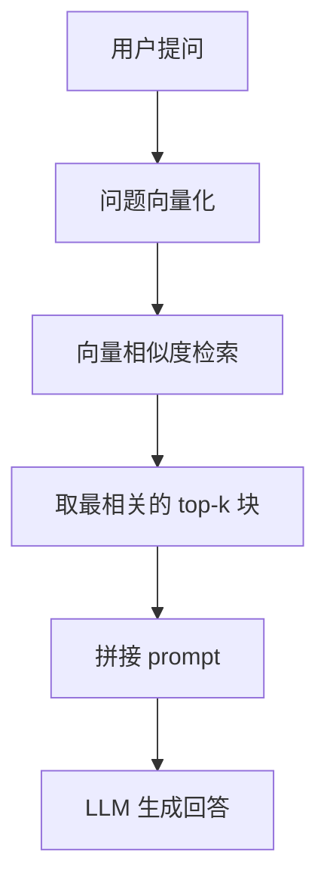
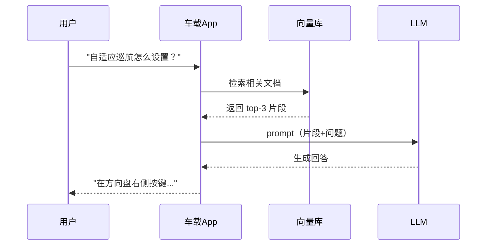

# 车载 RAG 实战：本地知识库问答

> 系列：AAOS-Guide · 09-rag
> 难度：⭐⭐⭐⭐ 进阶
> 更新：2026-08-26
> 前置知识：《大模型上车：端侧推理》

---

## 一、一个真实场景

司机在开车时问：「自适应巡航怎么设置跟车距离？」

这个问题有两个特点：
1. **答案在说明书里**（封闭域知识）
2. **需要即时、离线回答**（开车时没空翻手册，可能也没网）

这就是 **RAG（检索增强生成，Retrieval-Augmented Generation）** 的用武之地：让大模型「先查资料，再回答」。

## 二、RAG 是什么

RAG 解决大模型的两个痛点：

| 痛点 | RAG 的解法 |
|------|-----------|
| 不知道私有知识（说明书） | 先检索本地知识库 |
| 会「一本正经胡说」（幻觉） | 基于检索到的原文回答 |



**核心理解**：RAG 不是让模型「记住」所有知识，而是让模型「会查资料」。

## 三、RAG 的两大阶段

### 阶段 1：离线索引（建库）



1. **切分**：把长文档切成小块（比如每 500 字一块）。
2. **向量化**：用 Embedding 模型把每块文字转成向量。
3. **存库**：向量存入本地向量数据库。

### 阶段 2：在线问答（查询）



## 四、车载 RAG 的工程实现

### 1. 技术选型

| 组件 | 选型 | 说明 |
|------|------|------|
| 向量数据库 | SQLite + 向量扩展 / Milvus Lite | 端侧轻量 |
| Embedding | 小模型（如 bge-small） | 端侧可跑 |
| LLM | 端侧小模型 或 云端 | 端云协同 |

### 2. 代码骨架

```kotlin
// 阶段1：离线索引（一般在服务端/首次启动时执行）
fun buildIndex(manualText: String) {
    val chunks = splitChunks(manualText, 500)  // 切分
    chunks.forEach { chunk ->
        val vector = embedding.encode(chunk)    // 向量化
        vectorDB.insert(vector, chunk)          // 存库
    }
}

// 阶段2：在线问答
suspend fun ask(question: String): String {
    val qVector = embedding.encode(question)      // 问题向量化
    val hits = vectorDB.search(qVector, topK = 3) // 检索 top-3
    val context = hits.joinToString("\n") { it.text }

    // 拼接 prompt
    val prompt = """
        根据以下资料回答问题，如果资料中没有答案，请说「抱歉，暂时没有相关信息」。

        资料：
        $context

        问题：$question
    """.trimIndent()

    return llm.generate(prompt)  // LLM 生成
}
```

## 五、车载 RAG 的三个关键优化

### 1. 端侧 Embedding

Embedding 模型必须够小才能在车机跑。用量化后的小模型（几十 MB），比如 bge-small、m3e-small。

### 2. 向量库本地化

数据不传云端，隐私安全。SQLite + 向量扩展是常见选择，轻量且可靠。

### 3. 混合检索

纯向量检索可能漏掉「关键词完全匹配」的情况，可以结合：

- **向量检索**：语义相似
- **关键词检索**（BM25）：精确匹配

两者结果融合，召回率更高。

## 六、一个完整的车载问答流程



## 七、RAG 的常见坑

| 坑 | 建议 |
|----|------|
| 切分不当 | 按语义切分，别硬按字数 |
| 检索不准 | 调 top-k，结合关键词检索 |
| 上下文过长 | 控制检索片段数量 |
| 幻觉 | prompt 里明确「不知道就说不知道」 |

## 八、总结

| 要点 | 结论 |
|------|------|
| RAG 是什么 | 检索增强生成，先查资料再回答 |
| 两大阶段 | 离线索引 + 在线问答 |
| 车载优势 | 离线、隐私、封闭域准确 |
| 关键技术 | Embedding、向量库、混合检索 |

---

**下一篇预告**：《车载多模态：语音 + 视觉融合》

> 配套仓库：[AAOS-Guide](https://github.com/jason5200/AAOS-Guide) · [AI-Android-Demo](https://github.com/jason5200/AI-Android-Demo)
