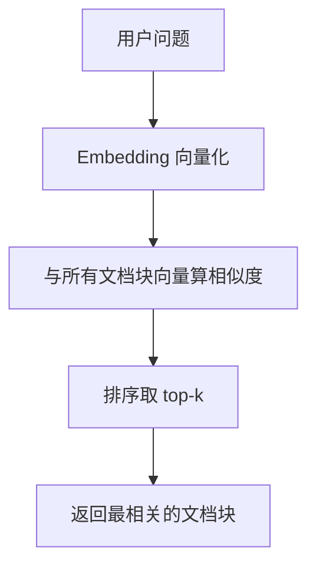
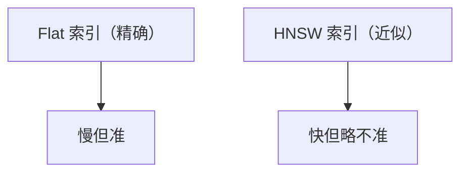

# RAG 向量检索的完整实现

> 系列：AAOS-Guide · 09-rag
> 难度：⭐⭐⭐⭐⭐ 深入
> 更新：2026-08-27
> 前置知识：《车载 RAG 实战》《Embedding 与向量化》

---

## 一、本文目标

前面讲了 RAG 的概念和「向量相似度检索」，这一篇深入到**实现**：从「一段文字」到「找到最相关的文档块」的完整代码。

## 二、完整的检索流程



## 三、第一步：向量化

用 Embedding 模型把文字转成向量：

```python
from sentence_transformers import SentenceTransformer

model = SentenceTransformer('BAAI/bge-small-zh')

def encode(text: str):
    """把文字转成向量"""
    return model.encode(text, normalize_embeddings=True)

question = "自适应巡航怎么设置？"
q_vector = encode(question)  # 512 维向量
```

## 四、第二步：相似度计算

**余弦相似度**是最常用的衡量方式：

```python
import numpy as np

def cosine_similarity(a, b):
    """余弦相似度：两个向量的夹角余弦"""
    return np.dot(a, b) / (np.linalg.norm(a) * np.linalg.norm(b))
```

**核心理解**：余弦相似度衡量「方向」而非「长度」，适合语义相似度（向量长度不影响语义）。

## 五、第三步：暴力检索（穷举）

最简单的实现：和所有文档块逐个算相似度：

```python
def brute_force_search(q_vector, doc_vectors, top_k=5):
    """暴力检索：遍历所有文档块"""
    scores = []
    for i, doc_vec in enumerate(doc_vectors):
        score = cosine_similarity(q_vector, doc_vec)
        scores.append((i, score))

    # 按分数降序排序，取 top-k
    scores.sort(key=lambda x: x[1], reverse=True)
    return scores[:top_k]
```

**问题**：文档块多时（百万级），暴力检索太慢（O(n)）。

## 六、第四步：用 FAISS 加速

FAISS 用 **ANN（近似最近邻）**索引加速检索：

```python
import faiss
import numpy as np

# 1. 建立索引
d = 512  # 向量维度
index = faiss.IndexFlatIP(d)  # 内积（等价余弦，需归一化）

# 2. 添加文档向量
doc_vectors = np.array([...]).astype('float32')
index.add(doc_vectors)

# 3. 检索 top-k
q_vector = q_vector.reshape(1, -1).astype('float32')
scores, indices = index.search(q_vector, k=5)

# indices 就是最相关的文档块索引
```

## 七、HNSW 索引（更快的近似检索）

数据量更大时，用 HNSW 图索引：

```python
# HNSW 索引：图结构，检索快
index = faiss.IndexHNSWFlat(d, 32)  # 32 是连接数
index.add(doc_vectors)
index.search(q_vector, k=5)
```



## 八、完整的检索管道代码

```python
class RAGRetriever:
    def __init__(self, embedder, index):
        self.embedder = embedder
        self.index = index

    def retrieve(self, question, top_k=5):
        # 1. 向量化问题
        q_vec = self.embedder.encode(question)

        # 2. 检索
        scores, indices = self.index.search(q_vec, top_k)

        # 3. 返回文档块
        results = []
        for i, idx in enumerate(indices[0]):
            results.append({
                "doc_id": idx,
                "score": scores[0][i],
                "text": self.get_doc_text(idx)
            })
        return results
```

## 九、总结

| 要点 | 结论 |
|------|------|
| 检索流程 | 向量化→相似度→排序→top-k |
| 相似度 | 余弦相似度 |
| 暴力检索 | O(n)，小数据可用 |
| FAISS | ANN 索引加速 |

---

**下一篇预告**：《AMS 进程管理的完整源码》

> 配套仓库：[AAOS-Guide](https://github.com/jason5200/AAOS-Guide)
