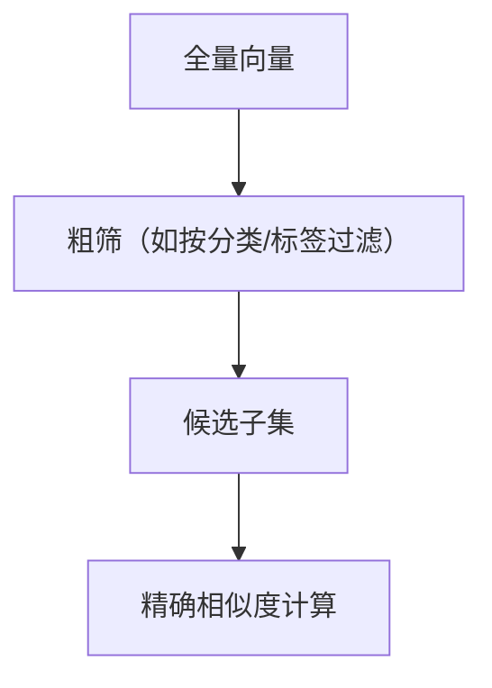

# 端侧向量检索的 SQLite 优化

> 系列：AAOS-Guide · 09-rag
> 难度：⭐⭐⭐⭐ 深入
> 更新：2026-08-27
> 前置知识：《向量数据库选型》《RAG 向量检索的完整实现》

---

## 一、为什么端侧用 SQLite

端侧 RAG 的向量存储，要轻量、无外部依赖。SQLite 是 Android 内置的数据库，天然适合：

| 方案 | 端侧适合度 |
|------|-----------|
| SQLite + 向量扩展 | ✅ 内置，轻量 |
| FAISS | ✅ 但需 native 库 |
| 完整 Milvus | ❌ 太重 |

## 二、SQLite 存向量的方式

向量是「浮点数组」，SQLite 里怎么存？

### 方式 1：BLOB 存原始字节

```sql
CREATE TABLE vectors (
    id INTEGER PRIMARY KEY,
    text TEXT,
    vec BLOB  -- 存浮点数组的原始字节
);
```

```kotlin
// 存入：把 FloatArray 转成 ByteArray
fun toBytes(vec: FloatArray): ByteArray {
    val buffer = ByteBuffer.allocate(vec.size * 4)
    vec.forEach { buffer.putFloat(it) }
    return buffer.array()
}

// 读取：把 ByteArray 转回 FloatArray
fun toFloats(bytes: ByteArray): FloatArray {
    val buffer = ByteBuffer.wrap(bytes)
    val vec = FloatArray(bytes.size / 4)
    vec.forEachIndexed { i, _ -> vec[i] = buffer.float }
    return vec
}
```

### 方式 2：JSON 字符串存（简单但慢）

```sql
INSERT INTO vectors (vec) VALUES ('[0.1, 0.2, 0.3, ...]');
```

**对比**：BLOB 更快更省，JSON 更简单但慢。

## 三、检索：在 SQLite 里算相似度

端侧数据量小（几千到几万条），可以「全表扫描 + 内存计算」：

```kotlin
fun search(queryVec: FloatArray, topK: Int): List<Pair<Long, Float>> {
    // 1. 全表读取所有向量
    val cursor = db.rawQuery("SELECT id, vec FROM vectors", null)
    val results = mutableListOf<Pair<Long, Float>>()

    while (cursor.moveToNext()) {
        val id = cursor.getLong(0)
        val vecBytes = cursor.getBlob(1)
        val vec = toFloats(vecBytes)

        // 2. 计算余弦相似度
        val score = cosineSimilarity(queryVec, vec)
        results.add(id to score)
    }

    // 3. 排序取 top-K
    results.sortByDescending { it.second }
    return results.take(topK)
}
```

## 四、优化 1：减少读取的数据量

全表扫描慢，可以用「粗筛」减少候选：



```sql
-- 按分类粗筛
SELECT id, vec FROM vectors WHERE category = '车控';
```

## 五、优化 2：内存缓存

把向量常驻内存，避免每次读磁盘：

```kotlin
// 启动时加载到内存
val vectorCache = mutableListOf<Pair<Long, FloatArray>>()

fun loadAll() {
    val cursor = db.rawQuery("SELECT id, vec FROM vectors", null)
    while (cursor.moveToNext()) {
        vectorCache.add(cursor.getLong(0) to toFloats(cursor.getBlob(1)))
    }
}

// 检索时用内存缓存
fun search(queryVec: FloatArray): List<Pair<Long, Float>> {
    return vectorCache
        .map { it.first to cosineSimilarity(queryVec, it.second) }
        .sortedByDescending { it.second }
        .take(topK)
}
```

## 六、优化 3：减少向量维度

向量维度影响计算量，可以用降维：

| 手段 | 说明 |
|------|------|
| PCA | 主成分降维 |
| 选更小模型 | 用 384 维替代 512 维 |
| 量化向量 | int8 向量加速 |

## 七、优化 4：SIMD 加速相似度

现代 CPU 有 SIMD 指令，可以加速点积：

```cpp
// C++ 用 SIMD 加速点积（简化）
#include <immintrin.h>

float dot_product_simd(const float* a, const float* b, int n) {
    __m256 sum = _mm256_setzero_ps();
    for (int i = 0; i < n; i += 8) {
        __m256 va = _mm256_loadu_ps(a + i);
        __m256 vb = _mm256_loadu_ps(b + i);
        sum = _mm256_add_ps(sum, _mm256_mul_ps(va, vb));
    }
    // ... 求和
}
```

## 八、性能对比

| 优化 | 提升 |
|------|------|
| 无优化（全扫描+磁盘） | 基准 |
| 内存缓存 | 快 10-100 倍 |
| 粗筛 | 快 5-10 倍 |
| SIMD | 快 4-8 倍 |
| 降维 | 快 2-4 倍 |

## 九、总结

| 要点 | 结论 |
|------|------|
| 存储 | BLOB 存字节 |
| 检索 | 全扫 + 余弦相似度 |
| 优化 | 缓存、粗筛、SIMD、降维 |

---

**下一篇预告**：《View measure 的源码全链路》

> 配套仓库：[AAOS-Guide](https://github.com/jason5200/AAOS-Guide)
