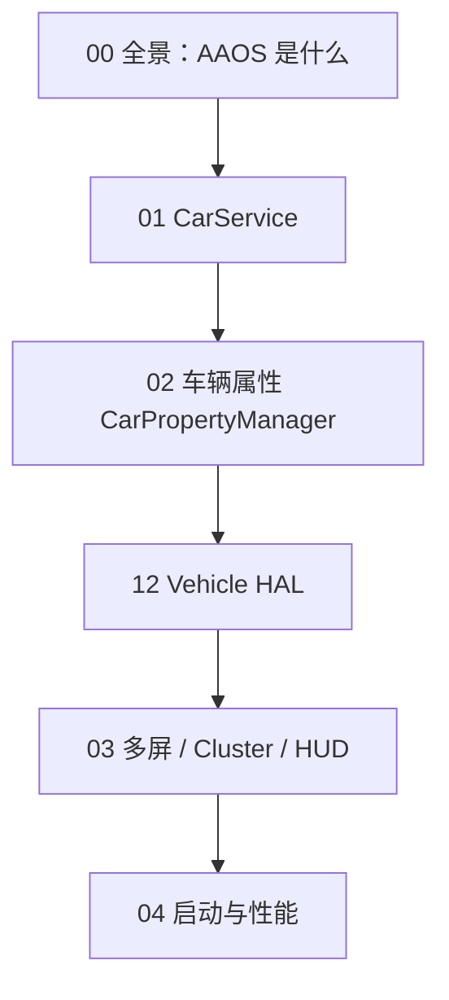

# 车载 Android（AAOS）系列导读

> 从零建立智能座舱的系统认知。本页只列**车载主线**（28 篇），大模型内容见 [AI 上车](ai.md)。
>
> 源码默认对照 AOSP [`android-14.0.0_r67`](https://github.com/jason5200/AAOS-Guide/blob/main/AOSP_VERSION.md)。

---

## 学习路线

## 文章目录（主线 28 篇）

| 序号 | 文章 |
|------|------|
| 00 | [车载 Android 全景：AAOS 到底是什么](../articles/00-overview/aaos-intro.md) |
| 01 | [CarService 架构](../articles/car-service/carservice-architecture.md) |
| 02 | [CarService 启动流程源码](../articles/car-service/carservice-startup-source.md) |
| 03 | [CarPropertyManager：读写车辆属性](../articles/carservice-api/carproperty-manager.md) |
| 04 | [CarPropertyService 源码](../articles/car-service/carproperty-source.md) |
| 05 | [电源状态管理](../articles/audio/car-power.md) |
| 06 | [空调控制](../articles/audio/car-hvac.md) |
| 07 | [车辆传感器：迁到 CarPropertyManager](../articles/audio/car-sensor.md) |
| 08 | [车辆静态信息](../articles/audio/car-info.md) |
| 09 | [驾驶分心 UX Restrictions](../articles/audio/car-ux.md) |
| 10 | [CarService 权限模型](../articles/permission/car-permission.md) |
| 11 | [Vehicle HAL](../articles/permission/vehicle-hal.md) |
| 12 | [多屏：Display 到 Surface](../articles/multi-display/multi-display.md) |
| 13 | [Cluster 仪表盘](../articles/multi-display/cluster.md) |
| 14 | [HUD](../articles/multi-display/hud.md) |
| 15 | [倒车影像与环视](../articles/perf/reverse-camera.md) |
| 16 | [CarAudioService](../articles/audio/car-audio-service.md) |
| 17 | [多媒体：音频焦点与分区](../articles/permission/multimedia.md) |
| 18 | [蓝牙电话 HFP](../articles/audio/bluetooth-hfp.md) |
| 19 | [导航](../articles/ota/navigation.md) |
| 20 | [OTA 与 A/B 分区](../articles/ota/ota-upgrade.md) |
| 21 | [启动到座舱可用](../articles/perf/boot-process.md) |
| 22 | [冷启动优化](../articles/perf/cold-start.md) |
| 23 | [低内存优化](../articles/perf/memory-optimization.md) |
| 24 | [V2X（概述）](../articles/ota/v2x.md) |
| 25 | [功能安全 ISO 26262（概述）](../articles/ota/functional-safety.md) |
| 26 | [CAN 总线安全（概述）](../articles/ota/can-security.md) |
| 27 | [模拟器与 HIL](../articles/perf/testing.md) |

部分文章的文件路径还在历史目录（如 `audio/`、`ota/`）下，侧边栏已按主题归类。

## 学习建议

1. 新手按 00 → 11 读完，先建立「系统服务 + 车辆属性 + HAL」心智模型。
2. 做 Launcher / 多屏再读 12–15；做语音/多媒体再读 16–18。
3. 标注「概述」的篇章是背景，不是实车实测。
4. 动手：[Car-Launcher-Demo](https://github.com/jason5200/Car-Launcher-Demo)（需要 AAOS 模拟器）。

## 配套资源

- 仓库：[AAOS-Guide](https://github.com/jason5200/AAOS-Guide)
- Demo：[Car-Launcher-Demo](https://github.com/jason5200/Car-Launcher-Demo)
