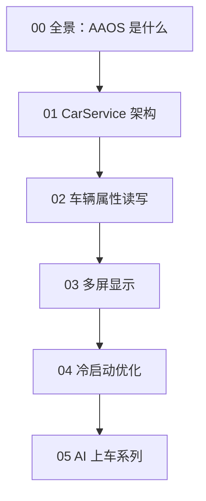

# 车载 Android（AAOS）系列导读 🚗

> 从零建立智能座舱的系统认知，按顺序阅读效果最佳。

---

## 学习路线

## 文章目录

| 序号 | 文章 | 难度 | 日期 |
|------|------|------|------|
| 00 | [车载 Android 全景：AAOS 到底是什么](../articles/00-overview/aaos-intro.md) | ⭐ 入门 | 08-15 |
| 01 | [CarService 架构：从 SystemServer 到车辆服务](../articles/car-service/carservice-architecture.md) | ⭐⭐ 进阶 | 08-16 |
| 02 | [CarPropertyManager：如何读写车辆属性](../articles/carservice-api/carproperty-manager.md) | ⭐⭐⭐ 实战 | 08-17 |
| 03 | [车机多屏显示：从 Display 到 Surface](../articles/multi-display/multi-display.md) | ⭐⭐⭐ 进阶 | 08-18 |
| 04 | [车机冷启动优化实战](../articles/perf/cold-start.md) | ⭐⭐⭐ 实战 | 08-19 |

## 学习建议

1. **新手**：按 00 → 04 顺序，先建立全景，再逐个深入。
2. **有基础**：可直接跳到 02（车辆属性）或 03（多屏），这两篇最贴近日常开发。
3. **实战配合**：搭配 [Car-Launcher-Demo](https://github.com/jason5200/Car-Launcher-Demo) 动手练。

## 配套资源

- 📖 仓库：[AAOS-Guide](https://github.com/jason5200/AAOS-Guide)
- 🧩 Demo：[Car-Launcher-Demo](https://github.com/jason5200/Car-Launcher-Demo)
