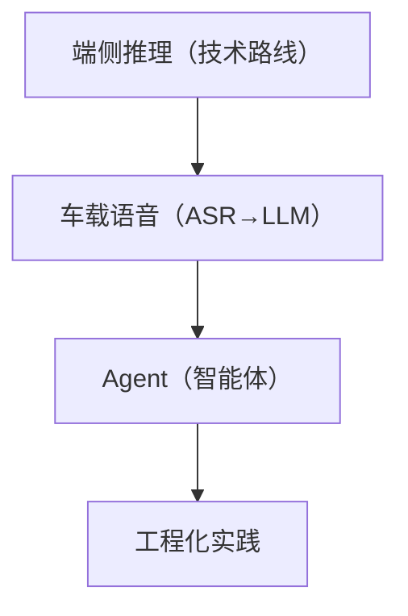

# AI 上车系列导读 🤖

> 大模型在车机端侧的落地路径，从原理到工程化。

---

## 学习路线

## 文章目录

| 序号 | 文章 | 难度 | 日期 |
|------|------|------|------|
| 01 | [大模型上车：端侧推理的可行方案](../articles/ai/on-device-llm.md) | ⭐⭐⭐ 进阶 | 08-20 |
| 02 | [车载语音助手：从 ASR 到 LLM](../articles/ai/voice-assistant.md) | ⭐⭐⭐ 进阶 | 08-21 |
| 03 | [Agent 在车机场景的应用](../articles/ai/agent-cockpit.md) | ⭐⭐⭐ 进阶 | 08-22 |
| 04 | [端侧 AI 的工程化实践](../articles/ai/ai-engineering.md) | ⭐⭐⭐⭐ 进阶 | 08-23 |

## 学习建议

1. **先看端侧推理**，建立「为什么 AI 要上车端」的认知。
2. **语音助手** 是最典型场景，理解 ASR→NLU→业务→NLG→TTS 五段链路。
3. **Agent** 是进阶方向，理解 LLM + 工具 + 记忆 + 规划。
4. **工程化** 是落地的最后一步，回答「Demo 怎么变成产品」。

## 配套资源

- 🤖 Demo：[AI-Android-Demo](https://github.com/jason5200/AI-Android-Demo)
- 📖 仓库：[AAOS-Guide](https://github.com/jason5200/AAOS-Guide)
