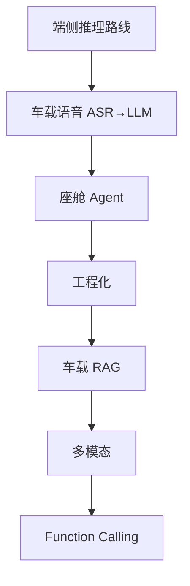

# AI 上车系列导读

> 大模型在车机端侧的落地。先读下面 **7 篇主线**；Transformer / 量化 / 通用 Agent 框架是选读，不挡车载系统学习。
>
> 配套 Demo：[AI-Android-Demo](https://github.com/jason5200/AI-Android-Demo)（配置 API Key 后走 OpenAI 兼容流式接口，否则为 Mock）。

---

## 主线（建议按序）

| 序号 | 文章 |
|------|------|
| 01 | [大模型上车：端侧推理的可行方案](../articles/ai/on-device-llm.md) |
| 02 | [车载语音助手：从 ASR 到 LLM](../articles/ai/voice-assistant.md) |
| 03 | [Agent 在车机场景的应用](../articles/ai/agent-cockpit.md) |
| 04 | [端侧 AI 的工程化实践](../articles/ai/ai-engineering.md) |
| 05 | [车载 RAG 实战](../articles/rag/car-rag.md) |
| 06 | [车载多模态](../articles/multimodal/multimodal.md) |
| 07 | [Function Calling 实战](../articles/agent/agent-framework.md) |

## 选读

完整 41 篇见侧边栏「AI 上车」。需要底层实现时再看：

| 主题 | 文章 |
|------|------|
| Transformer | [数学推导](../articles/ai/attention-math.md) · [Llama 注意力](../articles/ai/llama-attention.md) · [KV Cache](../articles/ai/llamacpp-kvcache.md) · [RoPE](../articles/ai/llamacpp-rope.md) · [采样](../articles/ai/llamacpp-sampling.md) |
| 量化 | [量化误差](../articles/ai/quantization-error.md) · [QAT](../articles/ai/qat.md) |
| RAG | [向量检索](../articles/rag/rag-search-source.md) · [SQLite](../articles/rag/sqlite-vector.md) |
| 推理 | [性能优化](../articles/ai/inference-perf.md) · [框架对比](../articles/ai/inference-framework.md) |

## 配套资源

- Demo：[AI-Android-Demo](https://github.com/jason5200/AI-Android-Demo)
- 路线仓库：[AAOS-Guide](https://github.com/jason5200/AAOS-Guide)
