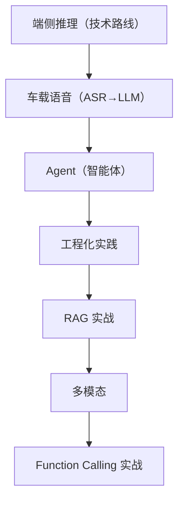

# AI 上车系列导读 🤖

> 大模型在车机端侧的落地路径，从原理到工程化。

---

## 学习路线

## 文章目录

| 序号 | 文章 | 难度 | 日期 |
|------|------|------|------|
| 01 | [大模型上车：端侧推理的可行方案](../articles/ai/on-device-llm.md) | ⭐⭐⭐ 进阶 | 08-20 |
| 02 | [车载语音助手：从 ASR 到 LLM](../articles/ai/voice-assistant.md) | ⭐⭐⭐ 进阶 | 08-21 |
| 03 | [Agent 在车机场景的应用](../articles/ai/agent-cockpit.md) | ⭐⭐⭐ 进阶 | 08-22 |
| 04 | [端侧 AI 的工程化实践](../articles/ai/ai-engineering.md) | ⭐⭐⭐⭐ 进阶 | 08-23 |
| 05 | [车载 RAG 实战：本地知识库问答](../articles/rag/car-rag.md) | ⭐⭐⭐⭐ 进阶 | 08-26 |
| 06 | [车载多模态：语音 + 视觉融合](../articles/multimodal/multimodal.md) | ⭐⭐⭐⭐ 进阶 | 08-26 |
| 07 | [Agent 框架：Function Calling 实战](../articles/agent/agent-framework.md) | ⭐⭐⭐⭐ 进阶 | 08-26 |

## 学习建议

1. **先看端侧推理**，建立「为什么 AI 要上车端」的认知。
2. **语音助手** 是最典型场景，理解 ASR→NLU→业务→NLG→TTS 五段链路。
3. **Agent** 是进阶方向，理解 LLM + 工具 + 记忆 + 规划。
4. **工程化** 是落地的关键，回答「Demo 怎么变成产品」。
5. **RAG / 多模态 / Function Calling** 是进阶实战，掌握后能做真正的车载 AI 应用。

## 🔬 源码级深度文章

想深入到底层实现，读这些「源码精读」：

| 主题 | 文章 |
|------|------|
| Transformer | [注意力机制数学推导](../articles/ai/attention-math.md) · [Llama 注意力源码](../articles/ai/llama-attention.md) · [llama.cpp KV Cache](../articles/ai/llamacpp-kvcache.md) · [llama.cpp RoPE](../articles/ai/llamacpp-rope.md) · [llama.cpp 采样算法](../articles/ai/llamacpp-sampling.md) |
| 量化 | [量化误差分析](../articles/ai/quantization-error.md) · [QAT 量化感知训练](../articles/ai/qat.md) |
| RAG | [向量检索实现](../articles/rag/rag-search-source.md) · [SQLite 向量优化](../articles/rag/sqlite-vector.md) |
| Embedding | [Embedding 模型源码](../articles/ai/embedding-source.md) |
| 推理 | [端侧推理性能优化](../articles/ai/inference-perf.md) |

## 配套资源

- 🤖 Demo：[AI-Android-Demo](https://github.com/jason5200/AI-Android-Demo)
- 📖 仓库：[AAOS-Guide](https://github.com/jason5200/AAOS-Guide)
