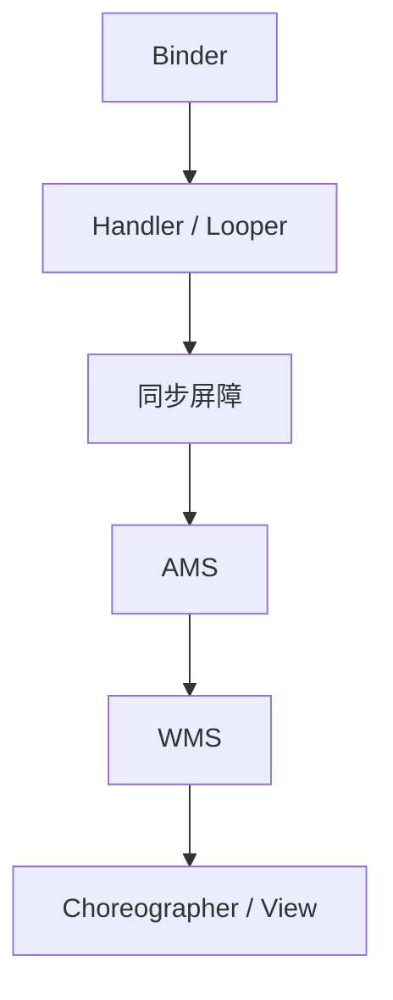

# Android Framework 系列导读

> Binder → Handler → AMS/WMS → View。默认对照 AOSP [`android-14.0.0_r67`](https://github.com/jason5200/Framework-Source-Note/blob/main/AOSP_VERSION.md)。
>
> 本系列共 **48 篇**。下面是推荐阅读顺序；完整列表见侧边栏。

---

## 学习路线

## 建议先读

| 序号 | 文章 |
|------|------|
| 01 | [Binder 机制总览](../articles/framework/binder-overview.md) |
| 02 | [一次 Binder 通信全流程](../articles/framework/binder-full-flow.md) |
| 03 | [Binder 驱动层](../articles/framework/binder-driver.md) |
| 04 | [Handler 消息机制](../articles/framework/handler-message-mechanism.md) |
| 05 | [IdleHandler](../articles/framework/idlehandler.md) |
| 06 | [同步屏障](../articles/framework/sync-barrier.md) |
| 07 | [AMS 启动流程](../articles/framework/ams-startup.md) |
| 08 | [WMS 窗口管理](../articles/framework/wms-window.md) |
| 09 | [Choreographer](../articles/framework/choreographer.md) |
| 10 | [View 事件分发](../articles/framework/touch-event.md) |
| 11 | [measure / layout / draw](../articles/framework/draw-process.md) |
| 12 | [ClassLoader](../articles/framework/classloader.md) |

## 源码精读（按主题）

| 主题 | 文章 |
|------|------|
| Binder | [mmap](../articles/framework/binder-mmap-deep.md) · [transaction](../articles/framework/binder-transaction-source.md) · [proc/thread](../articles/framework/binder-struct-source.md) · [线程池](../articles/framework/binder-threadpool-source.md) · [AIDL 生成代码](../articles/framework/aidl-generated.md) |
| Handler | [native 唤醒](../articles/framework/handler-native-wakeup.md) · [Looper C++](../articles/framework/looper-cpp.md) · [epoll](../articles/framework/looper-epoll-source.md) · [MessageQueue](../articles/framework/messagequeue-source.md) |
| View | [measure](../articles/framework/measure-source.md) · [layout/draw](../articles/framework/layout-draw-source.md) · [ViewRootImpl](../articles/framework/viewrootimpl-source.md) · [硬件加速](../articles/framework/hw-render-source.md) · [事件分发](../articles/framework/touch-source.md) · [RecyclerView](../articles/framework/recyclerview-source.md) |
| 组件 | [Service](../articles/framework/service-source.md) · [ContentProvider](../articles/framework/contentprovider-source.md) |
| AMS | [进程管理](../articles/framework/ams-process-source.md) |

## 配套资源

- 仓库：[Framework-Source-Note](https://github.com/jason5200/Framework-Source-Note)
