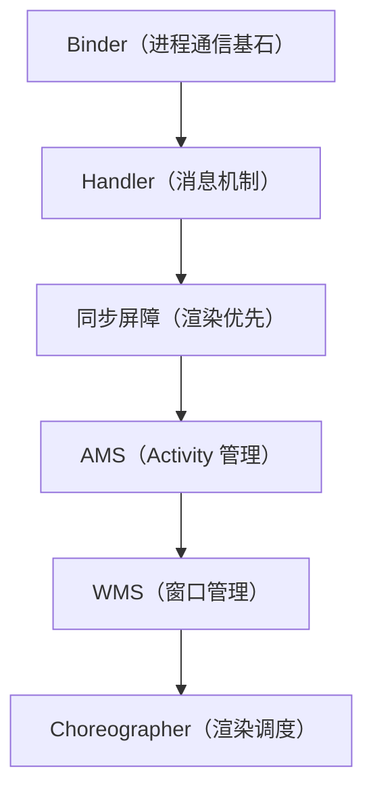

# Android Framework 系列导读 📚

> 系统级工程师的核心功底，从进程通信到渲染机制。

---

## 学习路线

## 文章目录

| 序号 | 文章 | 难度 | 日期 |
|------|------|------|------|
| 01 | [Binder 机制总览：为什么 Android 用它做 IPC](../articles/framework/binder-overview.md) | ⭐⭐⭐ 进阶 | 08-16 |
| 02 | [一次 Binder 通信的完整流程](../articles/framework/binder-full-flow.md) | ⭐⭐⭐⭐ 深入 | 08-17 |
| 03 | [Binder 驱动层深入](../articles/framework/binder-driver.md) | ⭐⭐⭐⭐⭐ 深入 | 08-23 |
| 04 | [Handler 消息机制：从 Looper 到 MessageQueue](../articles/framework/handler-message-mechanism.md) | ⭐⭐⭐ 进阶 | 08-18 |
| 05 | [消息队列与 IdleHandler](../articles/framework/idlehandler.md) | ⭐⭐⭐ 进阶 | 08-26 |
| 06 | [同步屏障与异步消息](../articles/framework/sync-barrier.md) | ⭐⭐⭐⭐ 深入 | 08-20 |
| 07 | [AMS 启动流程解析](../articles/framework/ams-startup.md) | ⭐⭐⭐⭐ 深入 | 08-21 |
| 08 | [WMS 窗口管理解析](../articles/framework/wms-window.md) | ⭐⭐⭐⭐ 深入 | 08-22 |
| 09 | [Choreographer 与渲染机制](../articles/framework/choreographer.md) | ⭐⭐⭐⭐ 深入 | 08-24 |
| 10 | [View 事件分发机制](../articles/framework/touch-event.md) | ⭐⭐⭐⭐ 深入 | 08-26 |
| 11 | [View 绘制流程：measure / layout / draw](../articles/framework/draw-process.md) | ⭐⭐⭐⭐ 深入 | 08-26 |
| 12 | [类加载机制：ClassLoader 与双亲委派](../articles/framework/classloader.md) | ⭐⭐⭐⭐ 深入 | 08-26 |

## 学习建议

1. **Binder → Handler** 是地基，务必先啃透，后面的 AMS/WMS 都建立在其上。
2. **同步屏障 + IdleHandler** 是理解「消息机制精细控制」的关键。
3. **AMS → WMS → Choreographer** 是「启动 → 显示 → 渲染」的完整链路。
4. **View 事件分发 → 绘制流程** 是「交互 → 显示」的 View 体系核心。
5. **类加载机制** 是热修复、插件化的基础。

## 配套资源

- 📚 仓库：[Framework-Source-Note](https://github.com/jason5200/Framework-Source-Note)
